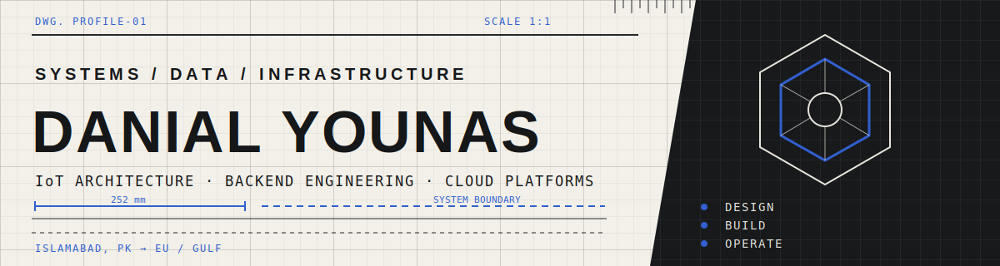

<p align="center">
  
</p>

<p align="center">
  <strong>Systems & Data Engineer · IoT Infrastructure Architect · Backend Engineer</strong><br>
  Building reliable data paths from field devices to operational decisions.
</p>

<p align="center">
  <a href="https://danial-1975.github.io/">Portfolio</a>
  &nbsp;·&nbsp;
  <a href="https://danial-1975.github.io/Danial_Younus_CV.pdf">Resume</a>
  &nbsp;·&nbsp;
  <a href="https://www.linkedin.com/in/danial-younas-the1975/">LinkedIn</a>
  &nbsp;·&nbsp;
  <a href="mailto:informdanial@gmail.com">Email</a>
</p>

<p align="center"><strong>🟢 Open to opportunities · Targeting EU/Gulf relocation</strong></p>

---

## Engineering systems from edge to operator

I build production infrastructure where **field protocols, backend services, cloud platforms, and operational dashboards** meet. My work is focused on turning fragmented device data into reliable, normalized, real-time systems that operators can actually trust.

Most of the systems I have built started without an existing architecture, a clean integration path, or a ready-made playbook. I enjoy owning that ambiguity: understanding the physical system, designing the data path, implementing the services, and making the whole stack recoverable and maintainable in production.

```text
FIELD DEVICES        EDGE / GATEWAYS       INGESTION & NORMALIZATION       OPERATIONS
Modbus · LoRaWAN ──► Protocol adapters ──► Go / Python / Java ──► MQTT ──► ECHO / Digital Twin
Vendor TCP · HTTP     Private networking     Validation · unified schema     Alerts · analytics
```

## Production work

- Architected a city-wide IoT data pipeline for **Capital Smart City**.
- Integrated **3,000+ devices across 7 operational zones**.
- Unified **5+ protocol families** into **20+ MQTT topics** and one normalized schema.
- Built decoder and ingestion services using **Go, Python, and Java**.
- Deployed isolated, Dockerized services on **AWS** with private multi-site connectivity through **WireGuard**.
- Supplied real-time data to **ECHO**, the city's digital-twin and command-and-control surface.

## Engineering focus

| Area | What I work on |
|---|---|
| **IoT & edge** | MQTT, LoRaWAN, Modbus RTU/TCP, gateways, device onboarding, payload decoding |
| **Backend systems** | Go services, Python tooling, REST APIs, schema normalization, PostgreSQL |
| **Cloud & platform** | AWS, Docker, Kubernetes, Terraform, Linux, private networking |
| **Data infrastructure** | Event streaming, Kafka, telemetry pipelines, validation, observability |

## Current technical direction

```text
[01] Kubernetes migration and production platform design
[02] GitOps workflows with Argo CD
[03] Infrastructure as Code on AWS with Terraform
[04] Reliable multi-site IoT operations and observability
```

## Self-learning labs

| Lab | Stack | Objective |
|---|---|---|
| **GitOps Lab** | Argo CD · Kubernetes · Helm | Declarative deployments, drift detection, and environment promotion |
| **HPC Cluster** | SLURM · PyTorch · Linux | Distributed scheduling and repeatable ML workloads |
| **Terraform on AWS** | Terraform · AWS · IAM | Reusable cloud infrastructure with controlled state and access |
| **Face Mask Detection** | YOLO · Python · OpenCV | Real-time computer-vision inference and deployment practice |

## Tech timeline

```text
JAN 2024   Joined as a Laravel Developer
APR 2024   Transitioned into Systems Engineering
MID 2024   Built the IoT pipeline for Capital Smart City
LATE 2024  Integrated LoRaWAN and Modbus across seven zones
2025       Began leading the Kubernetes migration to AWS
PRESENT    Seeking senior systems, backend, and platform roles in the EU and Gulf
```

## Core stack

`Go` `Python` `Java` `PostgreSQL` `Apache Kafka` `MQTT` `LoRaWAN` `Modbus RTU/TCP` `AWS` `Kubernetes` `Terraform` `Docker` `WireGuard` `Linux`

---

<p align="center">
  <strong>Hard infrastructure problem? Difficult integration? Unreliable pipeline?</strong><br>
  <a href="mailto:informdanial@gmail.com">informdanial@gmail.com</a>
</p>
